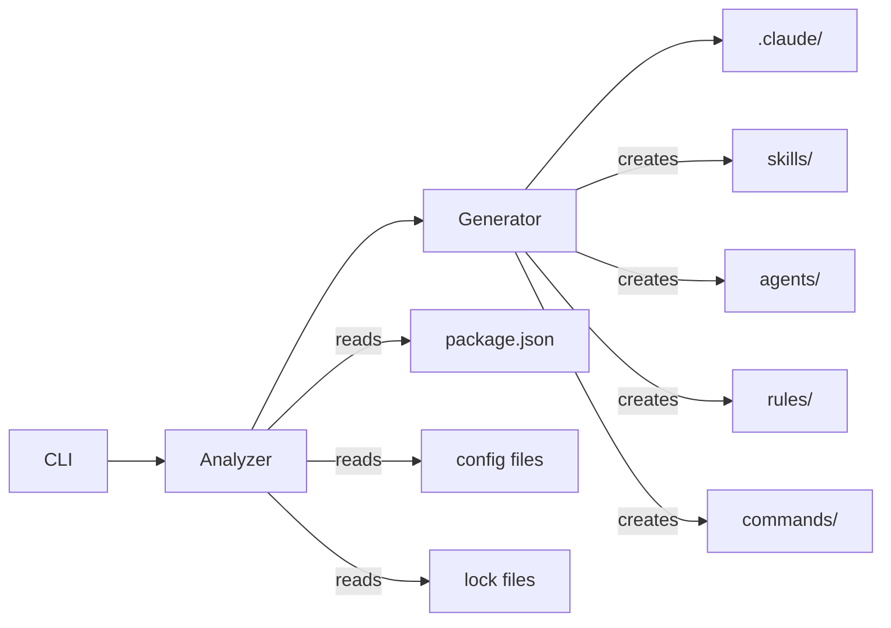

# Claude Code Starter

Intelligent CLI that bootstraps Claude Code configurations tailored to your project's tech stack.

## Quick Start

```bash
cd your-project
npx claude-code-starter
claude
```

## What It Does

1. **Analyzes your repository** - Detects languages, frameworks, tools, and patterns
2. **Generates tailored configurations** - Creates skills, agents, and rules for your stack
3. **Sets up development workflow** - Task tracking, commands, and methodology guides

## Tech Stack Detection

Automatically detects and configures for:

| Category       | Detected                                                            |
| -------------- | ------------------------------------------------------------------- |
| **Languages**  | TypeScript, JavaScript, Python, Go, Rust, Java, Ruby, and more      |
| **Frameworks** | Next.js, React, Vue, Svelte, FastAPI, Django, NestJS, Express, etc. |
| **Tools**      | npm, yarn, pnpm, bun, pip, cargo, go modules                        |
| **Testing**    | Jest, Vitest, Pytest, Go test, Rust test                            |
| **Linting**    | ESLint, Biome, Ruff, Pylint                                         |

## Generated Configurations

Based on your stack, creates:

- **📚 Skills** - Framework-specific patterns (e.g., Next.js App Router, FastAPI endpoints)
- **🤖 Agents** - Specialized assistants (code reviewer, test writer)
- **📏 Rules** - Language conventions (TypeScript strict mode, Python PEP 8)
- **⚡ Commands** - Workflow shortcuts (`/task`, `/status`, `/done`, `/analyze`)

## Commands

| Command           | Description         |
| ----------------- | ------------------- |
| `/task <desc>`    | Start a new task    |
| `/status`         | Show current task   |
| `/done`           | Mark task complete  |
| `/analyze <area>` | Deep dive into code |

## CLI Options

```bash
npx claude-code-starter           # Interactive mode
npx claude-code-starter -y        # Non-interactive (use defaults)
npx claude-code-starter -f        # Force overwrite existing files
npx claude-code-starter -V        # Verbose output
npx claude-code-starter --help    # Show help
```

## Example Output

```
╔═══════════════════════════════════╗
║   Claude Code Starter             ║
║   AI-Assisted Development Setup   ║
╚═══════════════════════════════════╝

🔍 Analyzing repository...

📊 Tech Stack Analysis
  Language: TypeScript
  Framework: Next.js
  Package Manager: bun
  Testing: vitest

✅ Configuration complete! (14 files)

Generated for your stack:
  📚 4 skills (pattern-discovery, testing-methodology, nextjs-patterns, ...)
  🤖 2 agents (code-reviewer, test-writer)
  📏 2 rules
```

## Project Structure

After running, your project will have:

```
.claude/
├── CLAUDE.md           # Project-specific instructions
├── settings.json       # Permissions configuration
├── agents/             # Specialized AI agents
│   ├── code-reviewer.md
│   └── test-writer.md
├── commands/           # Slash commands
│   ├── task.md
│   ├── status.md
│   ├── done.md
│   └── analyze.md
├── rules/              # Code style rules
│   ├── typescript.md   # (or python.md, etc.)
│   └── code-style.md
├── skills/             # Framework-specific patterns
│   ├── pattern-discovery.md
│   ├── systematic-debugging.md
│   ├── testing-methodology.md
│   └── nextjs-patterns.md  # (or fastapi-patterns.md, etc.)
└── state/
    └── task.md         # Current task tracking
```

## How It Works

### Architecture



### Artifact Generation

All artifacts are **generated dynamically** based on your detected tech stack. There are no static templates - content is created specifically for your project.

| Artifact Type | Generation Logic |
|---------------|------------------|
| **CLAUDE.md** | Generated with project name, description, and detected stack |
| **settings.json** | Generated with safe default permissions |
| **Skills** | Core skills + framework-specific patterns (if detected) |
| **Agents** | Code reviewer and test writer agents |
| **Rules** | Language-specific conventions + general code style |
| **Commands** | Task workflow commands (/task, /status, /done, /analyze) |

### Conflict Resolution

When running on an existing project with `.claude/` configuration:

| Scenario | Behavior |
|----------|----------|
| **New file** | Created |
| **Existing file** | Skipped (preserved) |
| **With `-f` flag** | Overwritten |
| **state/task.md** | Always preserved |

### Detection Sources

The CLI examines these files to detect your stack:

| Source | Detects |
|--------|---------|
| `package.json` | JS/TS frameworks, testing, linting |
| `pyproject.toml` / `requirements.txt` | Python frameworks, tools |
| `go.mod` | Go and its web frameworks |
| `Cargo.toml` | Rust and its frameworks |
| `*.lockfile` | Package manager (bun.lockb, yarn.lock, etc.) |
| `.github/workflows/` | CI/CD platform |
| Config files | Linters, formatters, bundlers |

### Framework-Specific Patterns

When a framework is detected, additional skills are generated:

| Framework | Generated Skill |
|-----------|-----------------|
| Next.js | `nextjs-patterns.md` - App Router, Server Components |
| React | `react-components.md` - Hooks, component patterns |
| FastAPI | `fastapi-patterns.md` - Async endpoints, Pydantic |
| NestJS | `nestjs-patterns.md` - Modules, decorators, DI |

### Artifact Examples

<details>
<summary><b>📚 Skill Example</b> (pattern-discovery.md)</summary>

```markdown
---
description: "Systematic approach to discovering patterns in unfamiliar codebases"
---

# Pattern Discovery

## When to Use
- Starting work on unfamiliar code
- Investigating "how does X work here?"
- Before making changes to existing systems

## Approach
1. Find entry points (main, index, app)
2. Trace data flow through the system
3. Identify naming conventions
4. Map directory structure to responsibilities
```
</details>

<details>
<summary><b>🤖 Agent Example</b> (code-reviewer.md)</summary>

```markdown
---
name: "Code Reviewer"
description: "Reviews code for quality, patterns, and potential issues"
model: "sonnet"
tools: ["Read", "Glob", "Grep"]
---

# Code Reviewer Agent

You are a code reviewer focused on:
- Code quality and readability
- Potential bugs and edge cases
- Performance considerations
- Security vulnerabilities
```
</details>

<details>
<summary><b>📏 Rule Example</b> (typescript.md)</summary>

```markdown
---
paths: ["**/*.ts", "**/*.tsx"]
---

# TypeScript Conventions

- Use strict mode (`"strict": true`)
- Prefer `interface` over `type` for object shapes
- Use explicit return types on exported functions
- Avoid `any`, prefer `unknown` for truly unknown types
```
</details>

<details>
<summary><b>⚡ Command Example</b> (task.md)</summary>

```markdown
---
description: "Start or switch to a new task"
---

# /task

Update `.claude/state/task.md` with:
- Task description from user input
- Status: In Progress
- Empty decisions/notes sections
- Clear next steps
```
</details>

## Tip

Add `.claude/` to your global gitignore:

```bash
echo ".claude/" >> ~/.gitignore
git config --global core.excludesfile ~/.gitignore
```

## Development

```bash
# Install dependencies
bun install

# Run in development mode
bun run dev

# Run tests
bun test

# Build
bun run build
```

## License

MIT
