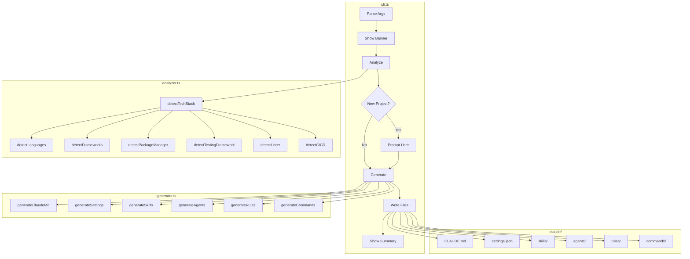

# Architecture

## Overview

Claude Code Starter is an intelligent CLI tool that analyzes repositories and generates tailored Claude Code configurations. It detects your tech stack and creates customized skills, agents, rules, and commands.

```
your-project/
└── .claude/
    ├── CLAUDE.md          # Project-specific instructions
    ├── settings.json      # Claude Code permissions
    ├── agents/            # Specialized AI personas
    │   ├── code-reviewer.md
    │   └── test-writer.md
    ├── commands/          # Slash commands (/task, /status, etc.)
    │   ├── task.md
    │   ├── status.md
    │   ├── done.md
    │   └── analyze.md
    ├── rules/             # Code style rules
    │   ├── typescript.md  # (or python.md, etc.)
    │   └── code-style.md
    ├── skills/            # Methodology guides
    │   ├── pattern-discovery.md
    │   ├── systematic-debugging.md
    │   ├── testing-methodology.md
    │   └── nextjs-patterns.md  # (framework-specific)
    └── state/
        └── task.md        # Current task tracking
```

## Tech Stack

| Component | Technology |
|-----------|------------|
| Runtime | Bun (local dev) / Node.js 18+ (distribution) |
| Language | TypeScript (strict mode) |
| Build | tsup (ESM output) |
| Testing | bun:test |
| Package Manager | Bun |

## Project Structure

```
claude-code-starter/
├── src/
│   ├── types.ts         # Type definitions
│   ├── analyzer.ts      # Repository analysis & tech stack detection
│   ├── generator.ts     # Artifact generation (skills, agents, rules)
│   ├── cli.ts           # Main CLI entry point
│   └── cli.test.ts      # Unit tests (55 tests)
├── docs/                # GitHub Pages & documentation
│   ├── index.html       # Landing page
│   ├── ARCHITECTURE.md  # This file
│   └── CODE-REVIEW.md   # Code review report
├── dist/                # Built output (gitignored)
└── package.json
```

## Module Overview

### `src/types.ts`

Core type definitions used across all modules:

| Type | Purpose |
|------|---------|
| `Args` | CLI argument flags |
| `TechStack` | Detected languages, frameworks, tools |
| `ProjectInfo` | Full repository analysis result |
| `GeneratedArtifact` | Single generated file (skill, agent, rule, command) |
| `GenerationResult` | Complete generation output |

### `src/analyzer.ts`

Repository analysis and tech stack detection:

| Function | Purpose |
|----------|---------|
| `analyzeRepository(dir)` | Main entry: returns `ProjectInfo` |
| `detectTechStack(dir)` | Detect all technologies |
| `summarizeTechStack(stack)` | Human-readable summary string |

**Internal detection functions:**
- `detectLanguages()` - Programming languages (.ts, .py, .go, etc.)
- `detectFrameworks()` - Web frameworks (Next.js, FastAPI, etc.)
- `detectPackageManager()` - npm, yarn, pnpm, bun, pip, cargo
- `detectTestingFramework()` - Jest, Vitest, Pytest, etc.
- `detectLinter()` - ESLint, Biome, Ruff, etc.
- `detectFormatter()` - Prettier, Black, etc.
- `detectBundler()` - Webpack, Vite, tsup, etc.
- `detectCICD()` - GitHub Actions, GitLab CI, etc.

### `src/generator.ts`

Dynamic artifact generation based on detected tech stack:

| Function | Purpose |
|----------|---------|
| `generateArtifacts(projectInfo)` | Generate all artifacts |
| `writeArtifacts(artifacts, dir, force)` | Write to filesystem |

**Generator functions:**
- `generateClaudeMd()` - Project-specific CLAUDE.md
- `generateSettings()` - Permissions configuration
- `generateSkills()` - Methodology guides + framework patterns
- `generateAgents()` - Code reviewer, test writer
- `generateRules()` - Language conventions
- `generateCommands()` - /task, /status, /done, /analyze

### `src/cli.ts`

Main entry point with CLI orchestration:

| Function | Purpose |
|----------|---------|
| `parseArgs(args)` | Parse CLI flags |
| `getVersion()` | Return package version |
| `main()` | CLI flow: analyze → prompt → generate → write |

## Data Flow



### Simplified View

```
┌─────────────┐     ┌──────────────┐     ┌───────────────┐
│   CLI       │ ──► │   Analyzer   │ ──► │   Generator   │
│ (cli.ts)    │     │(analyzer.ts) │     │(generator.ts) │
└─────────────┘     └──────────────┘     └───────────────┘
      │                    │                     │
      │              ProjectInfo            Artifacts[]
      │                    │                     │
      ▼                    ▼                     ▼
┌─────────────────────────────────────────────────────────┐
│                    User's Project                       │
│                    .claude/ directory                   │
└─────────────────────────────────────────────────────────┘
```

## Tech Stack Detection

The analyzer detects technologies by examining:

| Detection | Method |
|-----------|--------|
| Languages | File extensions (.ts, .py, .go) + config files |
| Frameworks | Dependencies in package.json, pyproject.toml, etc. |
| Package Manager | Lock files (bun.lockb, yarn.lock, etc.) |
| Testing | Test config files + dependencies |
| Linting | Config files (.eslintrc, biome.json, ruff.toml) |
| CI/CD | Workflow files (.github/workflows/, .gitlab-ci.yml) |

## Generated Artifacts

Artifacts are generated based on the detected tech stack:

| Artifact | Always Generated | Conditional |
|----------|-----------------|-------------|
| CLAUDE.md | ✓ | - |
| settings.json | ✓ | - |
| pattern-discovery.md | ✓ | - |
| systematic-debugging.md | ✓ | - |
| testing-methodology.md | ✓ | - |
| code-reviewer.md | ✓ | - |
| test-writer.md | ✓ | - |
| typescript.md | - | TypeScript detected |
| python.md | - | Python detected |
| nextjs-patterns.md | - | Next.js detected |
| fastapi-patterns.md | - | FastAPI detected |
| nestjs-patterns.md | - | NestJS detected |

## Build & Test

```bash
# Development
bun run dev          # Watch mode

# Build
bun run build        # Compile to dist/

# Test
bun test             # Run all 55 tests

# Type check
bun run typecheck    # TypeScript validation
```

## CI/CD

### Publish Workflow (`.github/workflows/publish.yml`)

Triggered on GitHub Release creation:
1. Extract version from tag
2. Install dependencies with Bun
3. Build and test
4. Publish to npm
5. Commit version bump to main

### Pages Workflow (`.github/workflows/pages.yml`)

Deploys `docs/` folder to GitHub Pages on push to main.

## Design Decisions

### Why Dynamic Generation?

Instead of copying static templates, the CLI generates content based on detected technologies:
- **Tailored output**: Only relevant skills/rules are created
- **No bloat**: Projects only get what they need
- **Better context**: CLAUDE.md references actual project details

### Why Bun?

- Faster local development
- Built-in test runner (no vitest needed)
- Native TypeScript support

### Why Node.js Compatibility?

- Broader user base can run via `npx`
- npm registry is the standard distribution channel

### Why Large generator.ts?

The generator file (1896 lines) contains all artifact templates. This is intentional:
- All templates are related (skills, agents, rules, commands)
- Easy to search and find templates
- Splitting would scatter related content
- No code duplication that warrants abstraction
