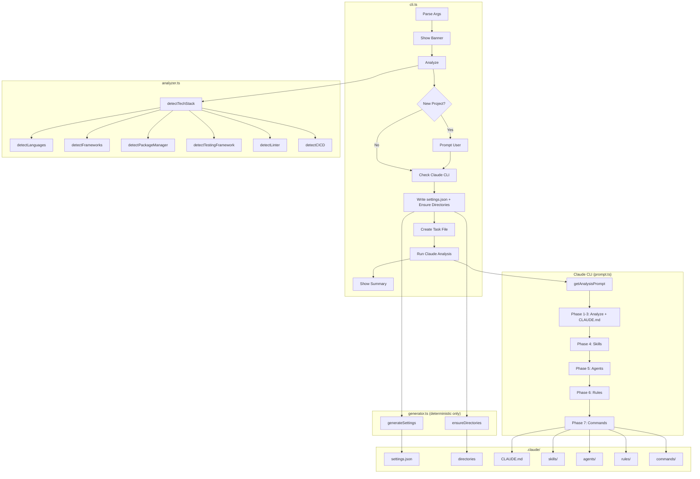

# Architecture

## Overview

Claude Code Starter is an intelligent CLI tool that analyzes repositories and generates tailored Claude Code configurations. It detects your tech stack, creates a `settings.json` with permission patterns, then uses the Claude CLI to deeply analyze the project and generate all content files (CLAUDE.md, skills, agents, rules, commands).

```
your-project/
└── .claude/
    ├── CLAUDE.md          # Project-specific instructions (Claude-generated)
    ├── settings.json      # Claude Code permissions (deterministic)
    ├── agents/            # Specialized AI personas (Claude-generated)
    │   ├── code-reviewer.md
    │   └── test-writer.md
    ├── commands/          # Slash commands (Claude-generated)
    │   ├── task.md
    │   ├── status.md
    │   ├── done.md
    │   ├── analyze.md
    │   └── code-review.md
    ├── rules/             # Code style rules (Claude-generated)
    │   ├── typescript.md  # (or python.md, etc.)
    │   └── code-style.md
    ├── skills/            # Methodology guides (Claude-generated)
    │   ├── pattern-discovery.md
    │   ├── systematic-debugging.md
    │   ├── testing-methodology.md
    │   ├── iterative-development.md
    │   ├── commit-hygiene.md
    │   ├── code-deduplication.md
    │   ├── simplicity-rules.md
    │   ├── security.md
    │   └── nextjs-patterns.md  # (framework-specific)
    └── state/
        └── task.md        # Current task tracking
```

## Tech Stack

| Component | Technology |
|-----------|------------|
| Runtime | Bun (local dev) / Node.js 22.14+ (distribution) |
| Language | TypeScript (strict mode) |
| Build | tsup (ESM output) |
| Testing | bun:test |
| Package Manager | Bun |

## Project Structure

```
claude-code-starter/
├── src/
│   ├── types.ts         # Type definitions (Args, TechStack, ProjectInfo, NewProjectPreferences)
│   ├── analyzer.ts      # Repository analysis & tech stack detection
│   ├── generator.ts     # Deterministic artifacts (settings.json + directory creation)
│   ├── prompt.ts        # Claude CLI prompt — generates ALL content files
│   ├── cli.ts           # Main CLI entry point
│   └── cli.test.ts      # Unit tests
├── docs/                # GitHub Pages & documentation
│   ├── index.html       # Landing page
│   ├── ARCHITECTURE.md  # This file
│   └── CHANGELOG.md     # Version history
├── dist/                # Built output (gitignored)
└── package.json
```

## Module Overview

### `src/types.ts`

Core type definitions used across all modules:

| Type | Purpose |
|------|---------|
| `Args` | CLI argument flags |
| `TechStack` | Detected languages, frameworks, tools |
| `ProjectInfo` | Full repository analysis result |
| `NewProjectPreferences` | User preferences for new projects (language, framework, tooling, project type) |

### `src/analyzer.ts`

Repository analysis and tech stack detection:

| Function | Purpose |
|----------|---------|
| `analyzeRepository(dir)` | Main entry: returns `ProjectInfo` |
| `detectTechStack(dir)` | Detect all technologies |
| `summarizeTechStack(stack)` | Human-readable summary string |

**Internal detection functions:**
- `detectLanguages()` - Programming languages (.ts, .py, .go, etc.)
- `detectFrameworks()` - Web frameworks (Next.js, FastAPI, etc.)
- `detectPackageManager()` - npm, yarn, pnpm, bun, pip, cargo
- `detectTestingFramework()` - Jest, Vitest, Pytest, etc.
- `detectLinter()` - ESLint, Biome, Ruff, etc.
- `detectFormatter()` - Prettier, Black, etc.
- `detectBundler()` - Webpack, Vite, tsup, etc.
- `detectCICD()` - GitHub Actions, GitLab CI, etc.

### `src/generator.ts`

Minimal deterministic artifact generation (~156 lines). Only handles non-AI-generated artifacts:

| Function | Purpose |
|----------|---------|
| `ensureDirectories(rootDir)` | Create `.claude/` subdirectories (skills, agents, rules, commands, state) |
| `generateSettings(stack)` | Build `settings.json` with permission patterns based on detected tech stack |
| `writeSettings(rootDir, stack)` | Write `settings.json` to disk |

### `src/prompt.ts`

Claude CLI prompt that generates ALL content files (~752 lines). This is where the heavy lifting happens:

| Function | Purpose |
|----------|---------|
| `getAnalysisPrompt(projectInfo)` | Build the full multi-phase prompt with tech stack context |

**Internal helpers:**
- `buildContextSection(projectInfo)` - Format pre-detected tech stack as prompt context
- `buildTemplateVariables(projectInfo)` - Build template variables (test commands, lint commands, source globs)
- `getTestCommand(stack)` - Determine the test command for the detected stack
- `getLintCommand(stack)` - Determine the lint command for the detected stack
- `getSourceGlobs(stack)` - Determine source file globs for the detected stack

**Prompt constants (composing the multi-phase protocol):**
- `ANALYSIS_PROMPT` - Phase 1-3: Discovery, CLAUDE.md generation, quality check
- `SKILLS_PROMPT` - Phase 4: Generate methodology and framework-specific skills
- `AGENTS_PROMPT` - Phase 5: Generate code reviewer and test writer agents
- `RULES_PROMPT` - Phase 6: Generate language-specific coding rules
- `COMMANDS_PROMPT` - Phase 7: Generate slash commands (/task, /status, /done, etc.)

### `src/cli.ts`

Main entry point with CLI orchestration:

| Function | Purpose |
|----------|---------|
| `parseArgs(args)` | Parse CLI flags |
| `getVersion()` | Return package version |
| `checkClaudeCli()` | Verify Claude CLI is installed |
| `runClaudeAnalysis(dir, projectInfo)` | Spawn Claude CLI for deep analysis + content generation |
| `main()` | CLI flow: analyze -> write settings + dirs -> Claude generates all content -> summary |

## Data Flow


```mermaid
flowchart TB
    subgraph CLI["cli.ts"]
        A[Parse Args] --> B[Show Banner]
        B --> C[Analyze]
        C --> D{New Project?}
        D -->|Yes| E[Prompt User]
        D -->|No| F[Check Claude CLI]
        E --> F
        F --> G[Write settings.json + Ensure Directories]
        G --> H[Create Task File]
        H --> I[Run Claude Analysis]
        I --> J[Show Summary]
    end

    subgraph Analyzer["analyzer.ts"]
        C --> K[detectTechStack]
        K --> L[detectLanguages]
        K --> M[detectFrameworks]
        K --> N[detectPackageManager]
        K --> O[detectTestingFramework]
        K --> P[detectLinter]
        K --> Q[detectCICD]
    end

    subgraph Generator["generator.ts (deterministic only)"]
        G --> R[generateSettings]
        G --> S[ensureDirectories]
    end

    subgraph ClaudeCLI["Claude CLI (prompt.ts)"]
        I --> T[getAnalysisPrompt]
        T --> U[Phase 1-3: Analyze + CLAUDE.md]
        U --> V[Phase 4: Skills]
        V --> W[Phase 5: Agents]
        W --> X[Phase 6: Rules]
        X --> Y[Phase 7: Commands]
    end

    subgraph Output[".claude/"]
        R --> Z[settings.json]
        S --> AA[directories]
        Y --> AB[CLAUDE.md]
        Y --> AC[skills/]
        Y --> AD[agents/]
        Y --> AE[rules/]
        Y --> AF[commands/]
    end
```

### Simplified View

```
┌─────────────┐     ┌──────────────┐     ┌───────────────┐     ┌───────────────┐
│   CLI       │ ──► │   Analyzer   │ ──► │   Generator   │ ──► │  Claude CLI   │
│ (cli.ts)    │     │(analyzer.ts) │     │(generator.ts) │     │ (prompt.ts)   │
└─────────────┘     └──────────────┘     └───────────────┘     └───────────────┘
      │                    │                     │                     │
      │              ProjectInfo           settings.json         ALL content
      │                    │              + directories       (CLAUDE.md, skills,
      │                    │                                  agents, rules, cmds)
      ▼                    ▼                     ▼                     ▼
┌─────────────────────────────────────────────────────────────────────────────┐
│                         User's Project                                     │
│                         .claude/ directory                                 │
└─────────────────────────────────────────────────────────────────────────────┘
```

## Tech Stack Detection

The analyzer detects technologies by examining:

| Detection | Method |
|-----------|--------|
| Languages | File extensions (.ts, .py, .go) + config files |
| Frameworks | Dependencies in package.json, pyproject.toml, etc. |
| Package Manager | Lock files (bun.lockb, yarn.lock, etc.) |
| Testing | Test config files + dependencies |
| Linting | Config files (.eslintrc, biome.json, ruff.toml) |
| CI/CD | Workflow files (.github/workflows/, .gitlab-ci.yml) |

## Generated Output

| Output | Generated By | Method |
|--------|-------------|--------|
| `settings.json` | `generator.ts` | Deterministic — permission patterns from detected tech stack |
| `.claude/` directories | `generator.ts` | Deterministic — `ensureDirectories()` |
| `CLAUDE.md` | Claude CLI | AI-generated via Phase 1-3 of prompt |
| `skills/*.md` | Claude CLI | AI-generated via Phase 4 of prompt |
| `agents/*.md` | Claude CLI | AI-generated via Phase 5 of prompt |
| `rules/*.md` | Claude CLI | AI-generated via Phase 6 of prompt |
| `commands/*.md` | Claude CLI | AI-generated via Phase 7 of prompt |

## Build & Test

```bash
# Development
bun run dev          # Watch mode

# Build
bun run build        # Compile to dist/

# Test
bun test             # Run all tests

# Type check
bun run typecheck    # TypeScript validation
```

## CI/CD

### Publish Workflow (`.github/workflows/publish.yml`)

Triggered on GitHub Release creation:
1. Extract version from tag
2. Install dependencies with Bun
3. Build and test
4. Publish to npm
5. Commit version bump to main

### Pages Workflow (`.github/workflows/pages.yml`)

Deploys `docs/` folder to GitHub Pages on push to main.

## Design Decisions

### Why Claude-Generated Content?

Instead of maintaining ~3000 lines of hardcoded markdown templates in `generator.ts`, Claude generates all content files tailored to each specific project. This was changed because:
- **Claude already knows** all the framework patterns, debugging guides, and coding conventions better than any static template
- **Tailored output**: Content is specific to the actual project, not generic boilerplate
- **Maintainability**: No need to update templates when frameworks evolve
- **Only `settings.json` remains deterministic** — permission patterns must be exact, not AI-generated

### Why Bun?

- Faster local development
- Built-in test runner (no vitest needed)
- Native TypeScript support

### Why Node.js Compatibility?

- Broader user base can run via `npx`
- npm registry is the standard distribution channel
