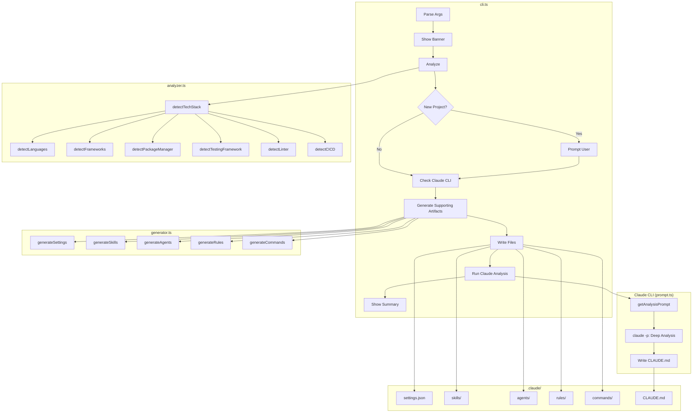

# Architecture

## Overview

Claude Code Starter is an intelligent CLI tool that analyzes repositories and generates tailored Claude Code configurations. It detects your tech stack, creates customized skills, agents, rules, and commands, then uses the Claude CLI to deeply analyze the project and generate a comprehensive CLAUDE.md.

```
your-project/
└── .claude/
    ├── CLAUDE.md          # Project-specific instructions
    ├── settings.json      # Claude Code permissions
    ├── agents/            # Specialized AI personas
    │   ├── code-reviewer.md
    │   └── test-writer.md
    ├── commands/          # Slash commands (/task, /status, etc.)
    │   ├── task.md
    │   ├── status.md
    │   ├── done.md
    │   ├── analyze.md
    │   └── code-review.md
    ├── rules/             # Code style rules
    │   ├── typescript.md  # (or python.md, etc.)
    │   └── code-style.md
    ├── skills/            # Methodology guides
    │   ├── pattern-discovery.md
    │   ├── systematic-debugging.md
    │   ├── testing-methodology.md
    │   ├── iterative-development.md
    │   ├── commit-hygiene.md
    │   ├── code-deduplication.md
    │   ├── simplicity-rules.md
    │   ├── security.md
    │   └── nextjs-patterns.md  # (framework-specific)
    └── state/
        └── task.md        # Current task tracking
```

## Tech Stack

| Component | Technology |
|-----------|------------|
| Runtime | Bun (local dev) / Node.js 18+ (distribution) |
| Language | TypeScript (strict mode) |
| Build | tsup (ESM output) |
| Testing | bun:test |
| Package Manager | Bun |

## Project Structure

```
claude-code-starter/
├── src/
│   ├── types.ts         # Type definitions
│   ├── analyzer.ts      # Repository analysis & tech stack detection
│   ├── generator.ts     # Artifact generation (skills, agents, rules)
│   ├── prompt.ts        # Claude CLI analysis prompt
│   ├── cli.ts           # Main CLI entry point
│   └── cli.test.ts      # Unit tests (124 tests)
├── docs/                # GitHub Pages & documentation
│   ├── index.html       # Landing page
│   ├── ARCHITECTURE.md  # This file
│   └── CHANGELOG.md     # Version history
├── dist/                # Built output (gitignored)
└── package.json
```

## Module Overview

### `src/types.ts`

Core type definitions used across all modules:

| Type | Purpose |
|------|---------|
| `Args` | CLI argument flags |
| `TechStack` | Detected languages, frameworks, tools |
| `ProjectInfo` | Full repository analysis result |
| `GeneratedArtifact` | Single generated file (skill, agent, rule, command) |
| `GenerationResult` | Complete generation output |

### `src/analyzer.ts`

Repository analysis and tech stack detection:

| Function | Purpose |
|----------|---------|
| `analyzeRepository(dir)` | Main entry: returns `ProjectInfo` |
| `detectTechStack(dir)` | Detect all technologies |
| `summarizeTechStack(stack)` | Human-readable summary string |

**Internal detection functions:**
- `detectLanguages()` - Programming languages (.ts, .py, .go, etc.)
- `detectFrameworks()` - Web frameworks (Next.js, FastAPI, etc.)
- `detectPackageManager()` - npm, yarn, pnpm, bun, pip, cargo
- `detectTestingFramework()` - Jest, Vitest, Pytest, etc.
- `detectLinter()` - ESLint, Biome, Ruff, etc.
- `detectFormatter()` - Prettier, Black, etc.
- `detectBundler()` - Webpack, Vite, tsup, etc.
- `detectCICD()` - GitHub Actions, GitLab CI, etc.

### `src/generator.ts`

Dynamic artifact generation based on detected tech stack:

| Function | Purpose |
|----------|---------|
| `generateArtifacts(projectInfo)` | Generate all artifacts |
| `writeArtifacts(artifacts, dir, force)` | Write to filesystem |

**Generator functions:**
- `generateSettings()` - Permissions configuration
- `generateSkills()` - Methodology guides + framework patterns
- `generateAgents()` - Code reviewer, test writer
- `generateRules()` - Language conventions
- `generateCommands()` - /task, /status, /done, /analyze

### `src/prompt.ts`

Claude CLI analysis prompt for deep project analysis:

| Function | Purpose |
|----------|---------|
| `getAnalysisPrompt(projectInfo)` | Build the full analysis prompt with tech stack context |
| `buildContextSection(projectInfo)` | Format pre-detected tech stack as prompt context |

### `src/cli.ts`

Main entry point with CLI orchestration:

| Function | Purpose |
|----------|---------|
| `parseArgs(args)` | Parse CLI flags |
| `getVersion()` | Return package version |
| `checkClaudeCli()` | Verify Claude CLI is installed |
| `runClaudeAnalysis(dir, projectInfo)` | Spawn Claude CLI for deep analysis |
| `main()` | CLI flow: analyze → generate → Claude analysis → summary |

## Data Flow


```mermaid
flowchart TB
    subgraph CLI["cli.ts"]
        A[Parse Args] --> B[Show Banner]
        B --> C[Analyze]
        C --> D{New Project?}
        D -->|Yes| E[Prompt User]
        D -->|No| F[Check Claude CLI]
        E --> F
        F --> G[Generate Supporting Artifacts]
        G --> H[Write Files]
        H --> I[Run Claude Analysis]
        I --> J[Show Summary]
    end

    subgraph Analyzer["analyzer.ts"]
        C --> K[detectTechStack]
        K --> L[detectLanguages]
        K --> M[detectFrameworks]
        K --> N[detectPackageManager]
        K --> O[detectTestingFramework]
        K --> P[detectLinter]
        K --> Q[detectCICD]
    end

    subgraph Generator["generator.ts"]
        G --> R[generateSettings]
        G --> S[generateSkills]
        G --> T[generateAgents]
        G --> U[generateRules]
        G --> V[generateCommands]
    end

    subgraph ClaudeCLI["Claude CLI (prompt.ts)"]
        I --> W[getAnalysisPrompt]
        W --> X[claude -p: Deep Analysis]
        X --> Y[Write CLAUDE.md]
    end

    subgraph Output[".claude/"]
        H --> Z[settings.json]
        H --> AA[skills/]
        H --> AB[agents/]
        H --> AC[rules/]
        H --> AD[commands/]
        Y --> AE[CLAUDE.md]
    end
```

### Simplified View

```
┌─────────────┐     ┌──────────────┐     ┌───────────────┐     ┌───────────────┐
│   CLI       │ ──► │   Analyzer   │ ──► │   Generator   │ ──► │  Claude CLI   │
│ (cli.ts)    │     │(analyzer.ts) │     │(generator.ts) │     │ (prompt.ts)   │
└─────────────┘     └──────────────┘     └───────────────┘     └───────────────┘
      │                    │                     │                     │
      │              ProjectInfo            Artifacts[]          CLAUDE.md
      │                    │                     │                     │
      ▼                    ▼                     ▼                     ▼
┌─────────────────────────────────────────────────────────────────────────────┐
│                         User's Project                                     │
│                         .claude/ directory                                 │
└─────────────────────────────────────────────────────────────────────────────┘
```

## Tech Stack Detection

The analyzer detects technologies by examining:

| Detection | Method |
|-----------|--------|
| Languages | File extensions (.ts, .py, .go) + config files |
| Frameworks | Dependencies in package.json, pyproject.toml, etc. |
| Package Manager | Lock files (bun.lockb, yarn.lock, etc.) |
| Testing | Test config files + dependencies |
| Linting | Config files (.eslintrc, biome.json, ruff.toml) |
| CI/CD | Workflow files (.github/workflows/, .gitlab-ci.yml) |

## Generated Artifacts

Artifacts are generated based on the detected tech stack:

| Artifact | Always Generated | Conditional |
|----------|-----------------|-------------|
| CLAUDE.md (via Claude CLI) | ✓ | - |
| settings.json | ✓ | - |
| pattern-discovery.md | ✓ | - |
| systematic-debugging.md | ✓ | - |
| testing-methodology.md | ✓ | - |
| iterative-development.md | ✓ | - |
| commit-hygiene.md | ✓ | - |
| code-deduplication.md | ✓ | - |
| simplicity-rules.md | ✓ | - |
| security.md | ✓ | - |
| code-reviewer.md | ✓ | - |
| test-writer.md | ✓ | - |
| code-review.md (command) | ✓ | - |
| typescript.md | - | TypeScript detected |
| python.md | - | Python detected |
| nextjs-patterns.md | - | Next.js detected |
| fastapi-patterns.md | - | FastAPI detected |
| nestjs-patterns.md | - | NestJS detected |

## Build & Test

```bash
# Development
bun run dev          # Watch mode

# Build
bun run build        # Compile to dist/

# Test
bun test             # Run all 124 tests

# Type check
bun run typecheck    # TypeScript validation
```

## CI/CD

### Publish Workflow (`.github/workflows/publish.yml`)

Triggered on GitHub Release creation:
1. Extract version from tag
2. Install dependencies with Bun
3. Build and test
4. Publish to npm
5. Commit version bump to main

### Pages Workflow (`.github/workflows/pages.yml`)

Deploys `docs/` folder to GitHub Pages on push to main.

## Design Decisions

### Why Dynamic Generation?

Instead of copying static templates, the CLI generates content based on detected technologies:
- **Tailored output**: Only relevant skills/rules are created
- **No bloat**: Projects only get what they need
- **Deep analysis**: CLAUDE.md is generated by Claude CLI reading actual source files, not static templates

### Why Bun?

- Faster local development
- Built-in test runner (no vitest needed)
- Native TypeScript support

### Why Node.js Compatibility?

- Broader user base can run via `npx`
- npm registry is the standard distribution channel

### Why Large generator.ts?

The generator file (~2600 lines) contains all artifact templates. This is intentional:
- All templates are related (skills, agents, rules, commands)
- Easy to search and find templates
- Splitting would scatter related content
- No code duplication that warrants abstraction
